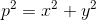
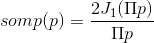
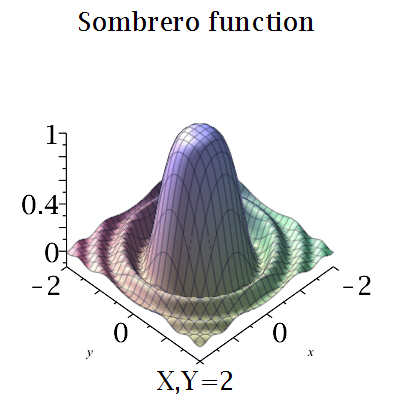
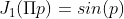
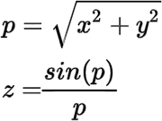

# Ripple-Cocos2dx

This library was created by **Lars Birkemose** on 02/12/11 and edited by **guanghui** on 7/30/13. Now I have custom it for compatible for both cocos2dx version 2x and version 3x. It work well for **iOS 8+** and **Android 19+**

## What is a Ripple effect ?  

Ripple effect is a situation in which, like ripples expand across the water when an object is dropped into it, an effect from an initial state can be followed outwards incrementally.  

<p align="center">

</p>

There is really nothing special to the ripple effect, in essence it is just an evaluation of the [sombrero function](http://adrianboeing.blogspot.com/2011/02/ripple-effect-in-webgl.html)  

### Sombrero function

**A sombrero function** (sometimes called **besinc function** or **jinc function**) is the 2-dimensional polar coordinate analog of the sinc function, and is so-called because it is shaped like a sombrero hat. This function is frequently used in image processing. It can be defined through the **Bessel function** of the first kind where : 

<p align="center">

</p>

<p align="center">

</p>

With **Riple Effect** just use 2D version of **sombrero function** and with 

<p align="center">

</p>

Then :

<p align="center">

</p>


The WebGL version of Ripple effect can see [here](https://mobilecodelab.com//showcase/riple)  

## How to use this ?

`-` Init Ripple Sprite :

```c++ 
rippleSprite = pgeRippleSprite::create("your image");

```

`-` Init Update function 

```c++ 
rippleSprite->update(dt);

```